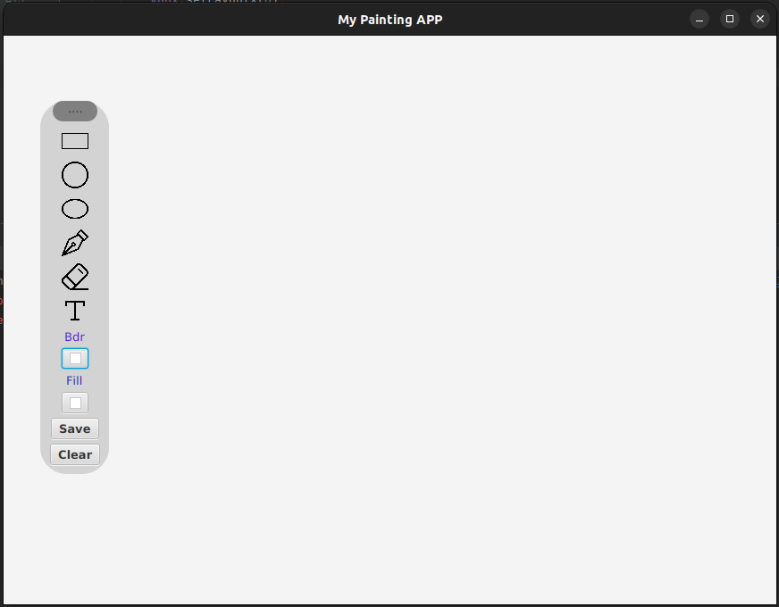

# Painting App

## Description
This is a painting application developed using Java and JavaFX. It allows users to draw shapes such as squares, circles, ovals, and lines, as well as use a pen tool. The app also provides an eraser tool, text input, fill color and border color customization, and the ability to save files.




## Features
- Drawing shapes: squares, circles, ovals, and lines.
- Pen tool: freehand drawing.
- Eraser tool: erase parts of the drawing.
- Text input: add text to the canvas.
- Customizable fill color and border color.
- Save file: save your artwork for future use.

## Requirements
- Java Development Kit (JDK) 8 or later
- JavaFX library

## Installation
   Clone the repository to your local machine:
   ```shell
   git clone https://github.com/RH-JavaFX-Projects/Painting-App.git
